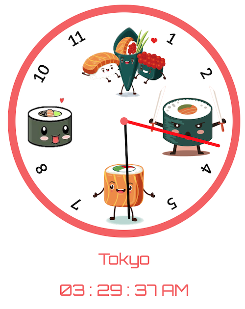

# **Here are Some Clocks that I made...**

## https://colewilldev.github.io/clock-js/ ##

This was a really fun project for me, I have always loved the variety of different styles that you see on the faces of watches growing up, as well as seeing a row of clocks at the airport that showcase different timezones across the world.  So I decided to combine both concepts, highly varied styles between each clock as well as 4 different timezones, and a digital diplay for each.

It was a little tricky computing the right time across all 4 clocks given that the getDate() function in JS returns Militarty time (1-24hrs).  So I had to program for that, as well as to be able to pass in a time zone and amount of time offset into both of my clock functions.

Really happy about the flamingo clock as I had a vision in my mind that I wanted a cartoon bird with the legs as the hands to tell time.  

Anyways, Hope you enjoy them as much as I do and thanks for stopping by!

